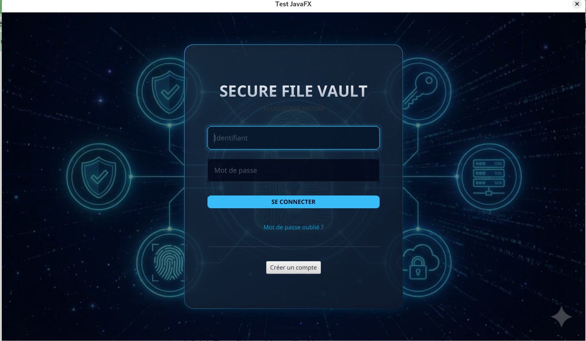
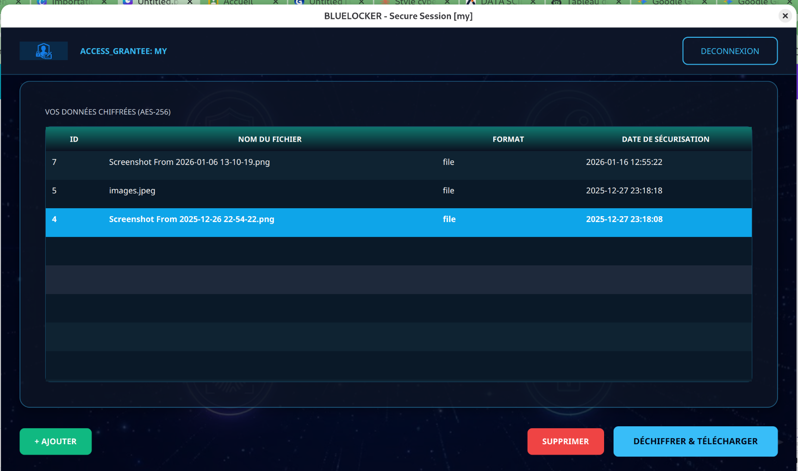

# 🔐 BlueLocker

> **Coffre-fort numérique sécurisé** avec chiffrement de bout en bout

[](https://www.oracle.com/java/)
[](https://openjfx.io/)
[](LICENSE)
[](https://maven.apache.org/)

BlueLocker est une application de bureau Java permettant de **stocker et gérer de manière sécurisée** des fichiers et notes sensibles via un chiffrement hybride robuste (AES-GCM + RSA-OAEP).


---

## ✨ Fonctionnalités principales

### 👤 Côté Utilisateur
- ✅ **Inscription et authentification sécurisées** (hash Argon2/BCrypt)
- 📁 **Stockage chiffré de fichiers** (documents, images, PDF, etc.)
- 📝 **Notes sécurisées** (texte chiffré)
- 🔍 **Interface intuitive** avec tableaux, recherche et filtres
- 🔒 **Chiffrement de bout en bout** : vos données restent privées même en cas de compromission de la base
- 🗑️ **Gestion complète** : ajout, consultation, suppression d'éléments

### 🛡️ Côté Administrateur
- 📊 **Dashboard statistiques** : utilisateurs, items, répartition par type
- 📈 **Graphiques** : PieChart, BarChart (JavaFX)
- 👥 **Gestion des utilisateurs** : promotion/rétrogradation, suppression
- 🔐 **Respect de la confidentialité** : l'admin n'accède qu'aux métadonnées, jamais au contenu

---

## 🏗️ Architecture

```
┌─────────────────────────────────────────────────┐
│              Interface (FXML + CSS)              │
│   Login │ Register │ UserDashboard │ AdminDash  │
└──────────────────┬──────────────────────────────┘
                   │
┌──────────────────▼──────────────────────────────┐
│              Controllers (JavaFX)                │
│  LoginController │ UserDashboardController │ …  │
└──────────────────┬──────────────────────────────┘
                   │
┌──────────────────▼──────────────────────────────┐
│            Services (Logique Métier)             │
│  AuthService │ DriveService │ AdminService │ …  │
└────────┬─────────────────────────┬───────────────┘
         │                         │
┌────────▼────────┐      ┌─────────▼──────────────┐
│  CryptoService  │      │     DAO (Persistance)  │
│  AES-GCM + RSA  │      │  UserDAO │ ItemDAO     │
└─────────────────┘      └─────────┬──────────────┘
                                   │
                         ┌─────────▼──────────────┐
                         │   Base de données      │
                         │  MySQL / PostgreSQL    │
                         └────────────────────────┘
```

**Pattern MVC** avec séparation claire des responsabilités.

---

## 🔒 Sécurité & Cryptographie

### Chiffrement Hybride
1. **AES-GCM (256 bits)** : chiffrement symétrique rapide des contenus (fichiers/notes)
   - Confidentialité + Intégrité (tag d'authentification)
   - Nonce unique par élément
2. **RSA-OAEP (2048 bits)** : chiffrement asymétrique de la clé AES
   - Padding OAEP avec SHA-256
   - Clé publique pour chiffrer, clé privée pour déchiffrer

### Gestion des clés
- **Paire RSA générée à l'inscription** pour chaque utilisateur
- **Clé privée chiffrée** avec une clé dérivée du mot de passe (PBKDF2/Argon2)
- **Clé publique** stockée en base (pour chiffrer les items)
- **Aucune clé en clair** dans la base de données

### Hash des mots de passe
- **Argon2** ou **BCrypt** (résistant aux attaques par dictionnaire)
- Sel unique par utilisateur

### Architecture Zero-Knowledge
- Le serveur/base ne peut **jamais** déchiffrer vos données
- Seul le mot de passe de l'utilisateur permet l'accès

---

## 🛠️ Technologies utilisées

| Couche              | Technologie                          |
|---------------------|--------------------------------------|
| **Langage**         | Java 17+                             |
| **Interface**       | JavaFX 21                            |
| **Build**           | Maven 3.8+                           |
| **Base de données** | MySQL / PostgreSQL / H2 (embedded)   |
| **Cryptographie**   | Java Cryptography Architecture (JCA) |
| **Tests**           | JUnit 5                              |
| **Design**          | CSS (thème Neo-Cyber)                |

---

## 📦 Installation

### Prérequis
- **Java JDK 17+** : [Télécharger](https://www.oracle.com/java/technologies/downloads/)
- **Maven 3.8+** : [Installer](https://maven.apache.org/install.html)
- **MySQL** ou **PostgreSQL** (ou laisser H2 en mode embedded)

### Étapes

1. **Cloner le repository**
```bash
git clone https://github.com/ton-username/BlueLocker.git
cd BlueLocker
```

2. **Configurer la base de données**

Créer une base MySQL :
```sql
CREATE DATABASE bluelocker_db CHARACTER SET utf8mb4 COLLATE utf8mb4_unicode_ci;
```

Modifier `src/main/resources/db.properties` :
```properties
db.url=jdbc:mysql://localhost:3306/bluelocker_db
db.user=root
db.password=ton_mot_de_passe
```

3. **Initialiser la base**
```bash
# Les tables seront créées automatiquement au premier lancement
# Ou exécuter manuellement :
mysql -u root -p bluelocker_db < src/main/resources/db/properties.sql
```

4. **Compiler et lancer**
```bash
# Compiler
mvn clean compile

# Lancer l'application
mvn javafx:run

# Ou créer un JAR exécutable
mvn package
java -jar target/BlueLocker-1.0.jar
```

---

## 🚀 Utilisation

### 1️⃣ Inscription
- Créer un compte avec email et mot de passe
- Une paire de clés RSA est générée automatiquement

### 2️⃣ Connexion
- S'authentifier avec vos identifiants
- Accès au Dashboard utilisateur

### 3️⃣ Ajouter un fichier sécurisé
- Cliquer sur "Ajouter un fichier"
- Sélectionner un fichier sur votre disque
- Le fichier est chiffré puis stocké

### 4️⃣ Créer une note sécurisée
- Cliquer sur "Nouvelle note"
- Rédiger votre texte confidentiel
- La note est chiffrée puis enregistrée

### 5️⃣ Consulter vos éléments
- Sélectionner un item dans la liste
- Le contenu est déchiffré à la volée (en mémoire)

### 6️⃣ Dashboard Admin (si compte ADMIN)
- Vue globale : stats, graphiques
- Gestion des utilisateurs (promotion, suppression)

---

## 📂 Structure du projet

```
BlueLocker/
├── src/
│   ├── main/
│   │   ├── java/
│   │   │   └── cryptographie/maya/
│   │   │       ├── controller/        # Contrôleurs JavaFX
│   │   │       │   ├── LoginController.java
│   │   │       │   ├── RegisterController.java
│   │   │       │   ├── UserDashboardController.java
│   │   │       │   └── AdminDashboardController.java
│   │   │       ├── model/             # Entités métier
│   │   │       │   ├── User.java
│   │   │       │   └── SecureItem.java
│   │   │       ├── service/           # Logique métier
│   │   │       │   ├── AuthService.java
│   │   │       │   ├── DriveService.java
│   │   │       │   └── AdminService.java
│   │   │       ├── dao/               # Accès aux données
│   │   │       │   ├── UserDAO.java
│   │   │       │   └── SecureItemDAO.java
│   │   │       ├── crypto/            # Module cryptographie
│   │   │       │   ├── CryptoService.java
│   │   │       │   ├── CryptoAesGcm.java
│   │   │       │   ├── CryptoRsaOaep.java
│   │   │       │   ├── KeyDerivation.java
│   │   │       │   └── RsaKeyManager.java
│   │   │       └── util/              # Utilitaires
│   │   │           ├── DatabaseManager.java
│   │   │           └── SessionManager.java
│   │   └── resources/
│   │       ├── fxml/                  # Interfaces FXML
│   │       │   ├── login.fxml
│   │       │   ├── register.fxml
│   │       │   ├── user_dashboard.fxml
│   │       │   └── admin_dashboard.fxml
│   │       ├── css/
│   │       │   └── style.css          # Thème Neo-Cyber
│   │       ├── img/                   # Images/icônes
│   │       └── db/
│   │           └── properties.sql     # Schéma de la base
│   └── test/
│       └── java/                      # Tests unitaires
├── pom.xml                            # Configuration Maven
├── README.md
└── LICENSE
```

---

## 🔐 Base de données

### Schéma

```sql
-- Table des utilisateurs
CREATE TABLE users (
    id INT PRIMARY KEY AUTO_INCREMENT,
    email VARCHAR(255) UNIQUE NOT NULL,
    passwordHash VARCHAR(255) NOT NULL,
    role VARCHAR(20) DEFAULT 'USER',
    publicKey TEXT,
    encryptedPrivateKey TEXT,
    createdAt TIMESTAMP DEFAULT CURRENT_TIMESTAMP
);

-- Table des éléments sécurisés
CREATE TABLE secure_items (
    id INT PRIMARY KEY AUTO_INCREMENT,
    userId INT NOT NULL,
    title VARCHAR(255) NOT NULL,
    itemType VARCHAR(20) NOT NULL,  -- 'FILE' ou 'NOTE'
    ciphertext LONGTEXT NOT NULL,
    nonce VARCHAR(255) NOT NULL,
    tag VARCHAR(255) NOT NULL,
    encryptedAesKey TEXT NOT NULL,
    createdAt TIMESTAMP DEFAULT CURRENT_TIMESTAMP,
    FOREIGN KEY (userId) REFERENCES users(id) ON DELETE CASCADE
);
```

---

## 🧪 Tests

```bash
# Lancer les tests
mvn test

# Tests avec couverture
mvn test jacoco:report
```

Tests couverts :
- ✅ Chiffrement/déchiffrement AES-GCM
- ✅ Chiffrement/déchiffrement RSA-OAEP
- ✅ Génération de clés
- ✅ Hash de mots de passe
- ✅ DAO (avec H2 in-memory)

---

## 🤝 Contribution

Les contributions sont les bienvenues !

1. Fork le projet
2. Créer une branche (`git checkout -b feature/AmazingFeature`)
3. Commit (`git commit -m 'Add AmazingFeature'`)
4. Push (`git push origin feature/AmazingFeature`)
5. Ouvrir une Pull Request

---

## 🛣️ Roadmap

- [ ] Partage sécurisé d'items entre utilisateurs
- [ ] Export/Import chiffré
- [ ] Support multi-langues (i18n)
- [ ] Mode hors-ligne avec synchronisation
- [ ] Audit logs (journalisation des accès)
- [ ] Support de Touch ID / Windows Hello
- [ ] Application mobile (Android/iOS)

---

## 📄 Licence

Ce projet est sous licence **MIT**. Voir le fichier [LICENSE](LICENSE) pour plus de détails.

---

## 👨‍💻 Auteur

**Ton Nom**
- GitHub: [@ton-username](https://github.com/ton-username)
- Email: ton.email@example.com

---

## 🙏 Remerciements

- [JavaFX](https://openjfx.io/) pour l'interface graphique
- [BouncyCastle](https://www.bouncycastle.org/) (si utilisé) pour la crypto avancée
- Communauté open-source Java

---

## ⚠️ Avertissement de sécurité

Ce projet est à but **éducatif et démonstratif**. Pour un usage en production critique :
- Faire auditer le code par un expert en sécurité
- Utiliser des HSM pour la gestion des clés sensibles
- Implémenter une rotation des clés
- Ajouter une authentification 2FA
- Respecter les réglementations (RGPD, etc.)

---

## 📸 Captures d'écran

### Login


### Dashboard Utilisateur


### Dashboard Admin


---

<div align="center">
  <strong>🔐 Vos données, votre clé, votre sécurité. 🔐</strong>
</div>
